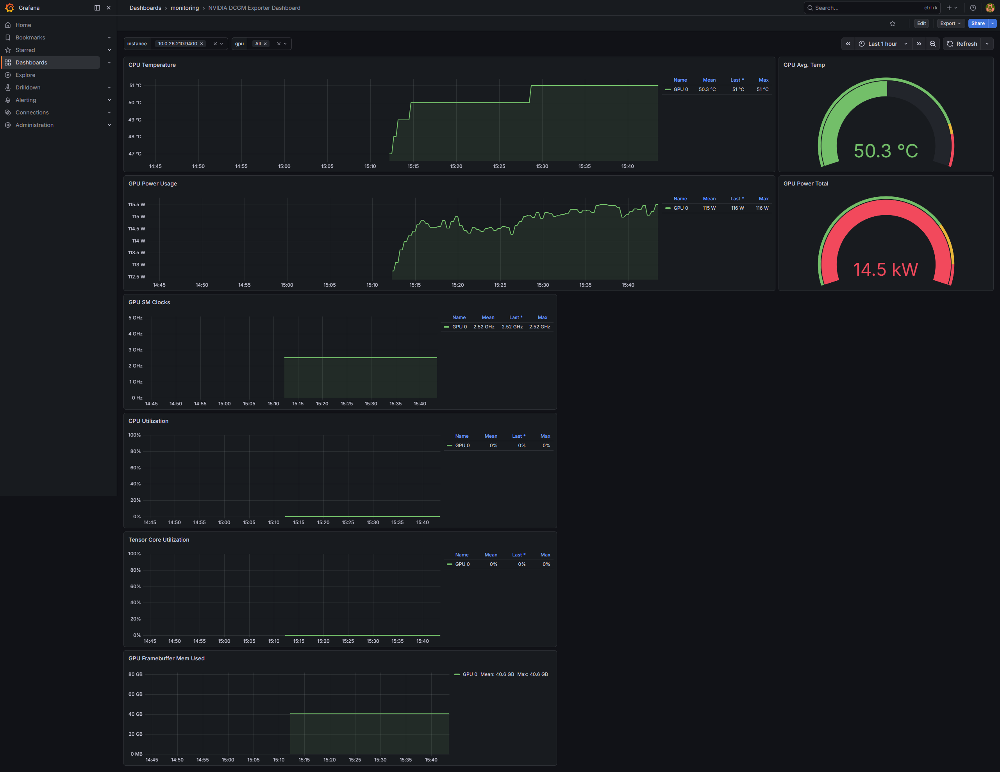

# 03 — Observability: GPU + engine metrics in Grafana

Goal: two dashboards that answer two different questions.

- **"Is the GPU healthy and busy?"** → NVIDIA DCGM Exporter (hardware truth)
- **"Is the inference engine efficient?"** → vLLM `/metrics` (software truth)

You need both. A GPU at 95 % utilization tells you nothing about whether requests are
queueing for 30 seconds.

> **In plain terms.** Think of a delivery van. **DCGM** is the dashboard behind the wheel —
> engine temperature, fuel, revs. **vLLM's `/metrics`** is the logistics screen — parcels
> delivered, parcels still in the depot, how long each customer waited. A van whose engine is
> running perfectly can still have a warehouse full of undelivered parcels, and no gauge on the
> dashboard will ever tell you that.
>
> How the numbers get to Grafana is simpler than people expect, and it's worth knowing because
> it explains this chapter's failure modes:
>
> ```
>   vLLM pod  ──/metrics──►  Prometheus  ──►  Grafana
>   DCGM pod  ──/metrics──►  (scrapes on a schedule)   (draws it)
> ```
>
> **Prometheus pulls.** Nothing pushes metrics anywhere. Each component exposes a plain-text HTTP
> page of numbers, and Prometheus fetches it every 30 seconds. vLLM has `/metrics` built in;
> for the GPU hardware you deploy **DCGM Exporter**, which reads NVIDIA's driver and republishes
> it in the same format.
>
> You tell Prometheus what to scrape with a **`ServiceMonitor`** — and here is the single most
> instructive trap in this tutorial. `ServiceMonitor`s must carry the label
> `release: kube-prometheus-stack`, because that's the selector Prometheus Operator uses to find
> them. Leave it off and your `ServiceMonitor` is created successfully, looks completely correct
> in `kubectl get`, and **is never read by anything.** No error, anywhere. That's the general
> shape of Kubernetes failure: a selector that matches nothing is a valid configuration.
>
> Also note that the dashboards here are **YAML files**, not clicks in a browser. The
> grafana-operator watches `GrafanaDashboard` objects and reconciles them into Grafana, so
> dashboards are version-controlled and survive Grafana being replaced. Chapter 09 swaps the
> entire serving layer and the monitoring stack keeps working for the price of two files.
>
> *Background:* [CONCEPTS Part 6](CONCEPTS.md#part-6--how-the-metrics-actually-get-into-grafana)
> and, for what the panel names mean,
> [Part 2](CONCEPTS.md#part-2--the-four-numbers-and-how-to-read-a-percentile).

## What's already installed

```bash
kubectl get pods -l "app.kubernetes.io/name=grafana" -n monitoring
kubectl get pods -l "app.kubernetes.io/name=grafana-operator" -n monitoring
```

```
NAME                              READY   STATUS    RESTARTS   AGE
kube-prometheus-stack-grafana-…   3/3     Running   0          <age>
NAME                 READY   STATUS    RESTARTS   AGE
grafana-operator-…   1/1     Running   0          <age>
```

The grafana-operator is pointed at the kube-prometheus-stack Grafana as an **external**
instance:

```bash
kubectl get Grafana external-grafana -n monitoring -o yaml
```

```yaml
apiVersion: grafana.integreatly.org/v1beta1
kind: Grafana
metadata:
  name: external-grafana
  namespace: monitoring
  labels:
    dashboards: external-grafana      # ← GrafanaDashboard CRs select this label
spec:
  external:
    adminPassword: {key: admin-password, name: grafana-admin-credentials}
    adminUser:     {key: admin-user,     name: grafana-admin-credentials}
    tenantNamespace: default
    url: http://kube-prometheus-stack-grafana.monitoring.svc.cluster.local:3000
status:
  dashboards:
  - monitoring/ray-grafana-serve-dashboard/rayServeDashboard
  - monitoring/ray-grafana-serve-deployment-dashboard/rayServeDeploymentDashboard
  - monitoring/vllm-dashboard/e163455f-d7a8-4e6a-8932-080ca14bd264
  - monitoring/vllm-ray-grafana-dashboard/vllm-ray-engine-metrics
  - monitoring/dcgm-grafana-dashboard/Oxed_c6Wz
  - monitoring/ray-grafana-default-dashboard/rayDefaultDashboard
  - monitoring/ray-grafana-inference-overview-dashboard/ray-serve-inference-overview
  stage: complete
  stageStatus: success
  version: 12.4.2
```

This is the pattern to take away: **dashboards are Kubernetes objects.** The `status.dashboards`
list is the operator's reconciliation record — seven dashboards declared as CRs and pushed
into Grafana. They are version-controlled, reviewable, and recreated automatically if Grafana
is replaced. Nobody exports JSON from a browser.

## Deploy DCGM Exporter

`100-vllm/dcgm-values.yaml`:

```yaml
serviceMonitor:
  enabled: true
  additionalLabels:
    release: kube-prometheus-stack   # ← REQUIRED for the Prometheus operator to select it
  interval: 30s
  honorLabels: true                  # ← keep DCGM's own pod/container labels

service:
  enable: true
  type: ClusterIP
  port: 9400
  annotations:
    prometheus.io/scrape: "true"
    prometheus.io/port: "9400"

nodeSelector:
  karpenter.sh/nodepool: gpu         # only GPU nodes have GPUs to export

tolerations:
  - key: "nvidia.com/gpu"
    operator: "Exists"
    effect: "NoSchedule"             # GPU nodes are tainted; opt in

podAnnotations:
  prometheus.io/scrape: "true"
  prometheus.io/port: "9400"

podLabels:
  app.kubernetes.io/name: "dcgm-exporter"

resources:
  limits:   {cpu: 500m, memory: 512Mi}
  requests: {cpu: 100m, memory: 256Mi}
```

Two lines cause almost all "my metrics never showed up" incidents:

- **`additionalLabels: release: kube-prometheus-stack`** — the Prometheus operator installed
  by the kube-prometheus-stack chart only selects `ServiceMonitor`s carrying that release
  label. Omit it and the `ServiceMonitor` exists, looks perfect, and is never scraped.
- **`honorLabels: true`** — DCGM attaches `pod`, `container`, and `namespace` labels
  identifying *which workload* is on the GPU. Without `honorLabels`, Prometheus overwrites
  them with the exporter's own pod identity and you lose per-workload attribution entirely.

```bash
helm repo add gpu-helm-charts https://nvidia.github.io/dcgm-exporter/helm-charts
helm repo update

helm install dcgm-exporter gpu-helm-charts/dcgm-exporter \
  -n monitoring \
  -f 100-vllm/dcgm-values.yaml

kubectl wait pods --for=jsonpath='{.status.phase}'=Running \
  -l "app.kubernetes.io/name=dcgm-exporter" -n monitoring --timeout=300s
```

```
NAME: dcgm-exporter
NAMESPACE: monitoring
STATUS: deployed
pod/dcgm-exporter-… condition met
```

### Confirm per-pod GPU attribution

```bash
NAME=$(kubectl get pods -l "app.kubernetes.io/name=dcgm-exporter" -n monitoring \
        -o "jsonpath={.items[0].metadata.name}")
kubectl port-forward -n monitoring $NAME 9400:9400
```

```bash
curl -sL http://127.0.0.1:9400/metrics
```

```
# HELP DCGM_FI_DEV_GPU_TEMP GPU temperature (in C).
DCGM_FI_DEV_GPU_TEMP{gpu="0",UUID="GPU-…",pci_bus_id="00000000:30:00.0",
  device="nvidia0",modelName="NVIDIA L40S",hostname="i-<gpu-node-id>",
  container="vllm",namespace="default",pod="mistral-…"} 51

DCGM_FI_DEV_FB_USED{…,container="vllm",pod="mistral-…"} 40562
DCGM_FI_DEV_FB_FREE{…,container="vllm",pod="mistral-…"} 4895
DCGM_FI_DEV_POWER_USAGE{…} 115.469
DCGM_FI_DEV_SM_CLOCK{…} 2520
DCGM_FI_DEV_MEM_CLOCK{…} 9001
DCGM_FI_PROF_PIPE_TENSOR_ACTIVE{…} 0
DCGM_FI_PROF_GR_ENGINE_ACTIVE{…} 0
DCGM_FI_PROF_DRAM_ACTIVE{…} 0
```

Look at `container="vllm"`, `pod="mistral-…"` on a *hardware* metric. That's
the payoff from `honorLabels: true`: you can now write PromQL that answers "how much
framebuffer is that specific deployment holding?" and "which pod is heating the card?" — on a
multi-tenant GPU node this is the difference between observability and guesswork.

Also note `DCGM_FI_DEV_FB_USED 40562` MiB against `FB_FREE 4895` MiB. vLLM has claimed ~40 GB
of the 48 GB card and is *holding* it, idle. GPU memory is reserved at startup, not on
demand. Whatever you don't allocate to KV cache is wasted for the pod's whole life.

## Wire vLLM's own metrics into Prometheus

vLLM already exposes `/metrics` (Chapter 02's route table). No sidecar, no exporter —
just tell Prometheus to scrape it.

`100-vllm/vllm-servicemonitor.yaml`:

```yaml
apiVersion: monitoring.coreos.com/v1
kind: ServiceMonitor
metadata:
  name: mistral-monitor
  namespace: monitoring              # ServiceMonitor lives with Prometheus…
  labels:
    release: kube-prometheus-stack   # …and must carry the release label
spec:
  namespaceSelector:
    matchNames:
      - default                      # …but selects a Service in `default`
  selector:
    matchLabels:
      model: mistral                 # matches vllm-serve-svc's labels
  endpoints:
    - port: http                     # NAMED port, not a number
      interval: 30s
      path: /metrics
```

```bash
kubectl apply -f 100-vllm/vllm-servicemonitor.yaml
```

```
servicemonitor.monitoring.coreos.com/mistral-monitor created
```

Three subtleties, all of which fail silently:

1. The `ServiceMonitor` lives in `monitoring` but targets a Service in `default` — hence
   `namespaceSelector`. Cross-namespace is normal and correct.
2. `port: http` is the Service's **port name**. A number here is invalid; the operator
   resolves names only.
3. `selector.matchLabels` matches the **Service**, not the pod. If your Service lacks
   `model: mistral`, nothing is discovered.

## Expose Grafana

`100-vllm/grafana-ingress.yaml`:

```yaml
apiVersion: networking.k8s.io/v1
kind: Ingress
metadata:
  name: grafana-ingress
  namespace: monitoring
  annotations:
    alb.ingress.kubernetes.io/scheme: internet-facing
    alb.ingress.kubernetes.io/target-type: ip
    alb.ingress.kubernetes.io/healthcheck-path: /api/health   # ← Grafana's health endpoint
    alb.ingress.kubernetes.io/healthcheck-interval-seconds: '10'
    alb.ingress.kubernetes.io/healthcheck-timeout-seconds: '9'
    alb.ingress.kubernetes.io/healthy-threshold-count: '2'
    alb.ingress.kubernetes.io/unhealthy-threshold-count: '10'
    alb.ingress.kubernetes.io/success-codes: '200-302'
    alb.ingress.kubernetes.io/load-balancer-name: grafana-ingress
  labels: {app: grafana-ingress}
spec:
  ingressClassName: alb
  rules:
  - http:
      paths:
      - path: /
        pathType: Prefix
        backend:
          service:
            name: kube-prometheus-stack-grafana
            port: {number: 3000}
```

```bash
kubectl apply -f 100-vllm/grafana-ingress.yaml

kubectl wait --for=jsonpath='{.status.loadBalancer.ingress[0].hostname}' \
  ingress/grafana-ingress -n monitoring --timeout=300s

export GRAFANA_URL=$(kubectl get ingress/grafana-ingress -n monitoring \
  -o jsonpath='{.status.loadBalancer.ingress[0].hostname}')

aws elbv2 wait load-balancer-available --load-balancer-arns \
  $(aws elbv2 describe-load-balancers \
      --query 'LoadBalancers[?DNSName==`'"$GRAFANA_URL"'`].LoadBalancerArn' --output text)

echo "Grafana is ready and available at: http://${GRAFANA_URL}"

export GRAFANA_PASSWORD=$(kubectl get secret -n monitoring kube-prometheus-stack-grafana \
  -o jsonpath="{.data.admin-password}" | base64 --decode)
echo "  Username: admin"
echo "  Password: ${GRAFANA_PASSWORD}"
```

```
ingress.networking.k8s.io/grafana-ingress condition met
Grafana is ready and available at: http://<ALB_DNS>
Grafana Credentials:
  Username: admin
  Password: <REDACTED>
```

`healthcheck-path: /api/health` — Grafana's `/` redirects to `/login`, so pointing the health
check at `/` makes the target group depend on `success-codes` accepting 302. `/api/health`
returns a clean `200` and is the correct answer.

> The workshop's admin password is a well-known static string. Rotate it, or don't expose
> Grafana at all — port-forward instead.

## Generate load so the dashboards aren't empty

```bash
export MODEL_NAME=$(curl -s http://localhost:8000/v1/models | jq -r '.data[0].id')

for i in {1..10}; do
  curl -s http://localhost:8000/v1/completions \
    -H "Content-Type: application/json" \
    -d "{\"model\": \"$MODEL_NAME\", \"prompt\": \"Tell me about artificial intelligence in\",
         \"max_tokens\": 50, \"temperature\": 0.7}" \
  | jq '.choices[0].text' && echo "Request $i completed"
  sleep 2
done
```

```
" the workplace.\n\nArtificial Intelligence (AI) is increasingly transforming the workplace…"
Request 1 completed
…
Request 10 completed
```

## The GPU dashboard

`Dashboards → monitoring → NVIDIA DCGM Exporter Dashboard` (UID `Oxed_c6Wz`):



Read it as a story about idle cost:

| Panel | Value | Interpretation |
|---|---|---|
| GPU Temperature | 47 °C → **51 °C** at ~15:10 | The step is the moment vLLM loaded the model |
| GPU Power Usage | flat, then **~115 W** | An L40S idles ~40 W; 115 W is "weights resident, nothing to do" |
| GPU SM Clocks | **2.52 GHz** | Clocked up and staying there |
| **GPU Utilization** | **0 %** | No inference in flight at this instant |
| **Tensor Core Utilization** | **0 %** | Confirms the same from the compute-pipe side |
| **GPU Framebuffer Mem Used** | **40.6 GB**, flat | Weights + KV cache reservation, held constantly |

That combination — 0 % utilization, 40.6 GB pinned, 115 W burning — *is* the economics of GPU
inference. You pay for the whole card from the moment the model loads. Utilization is a
business metric, not just an engineering one, and it's the reason the next three chapters
exist (benchmark it, cache aggressively, share the adapter instead of the base model).

Note the `instance` template variable at the top (`10.0.26.210:9400`) and `gpu = All`. On a
multi-GPU or multi-node cluster those selectors are how you isolate one card.

## The vLLM engine metrics dashboard

`Dashboards → monitoring → vLLM Benchmarking Engine Metrics`, filtered to
`model_name = ministral`. This screenshot was taken *during* the Chapter 05 saturation
benchmark, which is why it's so much more interesting than an idle capture:


The panels, and why each one earns its place:

| Panel | What it showed | Why it matters |
|---|---|---|
| Total / Success Requests per Minute | ramp 0 → **~800 req/min**, then cliff to 0 | The load stages, and the clean stop at the end |
| Request prefill time | 0.05 s → **0.28 s** | Prefill grows with batch size; this is compute-bound work |
| Request decode time | 2 s → **28 s** | Decode dominates end-to-end latency under load |
| **Request Queue Time** | ~0 s → **~1 min** | **The saturation signal.** Time spent waiting, not computing |
| **Cache Utilization** | GPU cache 0 % → **~75 %** plateau | KV cache is the binding constraint, not FLOPs |
| Token Throughput | **~4,000** prompt tok/s, **~2,400** generation tok/s | Prefill and decode throughput are different numbers |
| Time Per Output Token | p99 20 ms → **~110 ms** | What a streaming user perceives as "getting slow" |
| E2E Request Latency | → **~1.33 min** | The full user-visible number |
| **Time To First Token** | p50…p99 all exceed **1 min** at peak | The metric that makes an interactive app unusable |
| Scheduler State | Num Running plateaus ~250, **Num Waiting spikes ~440** | Running is capped; the excess is pure queueing |
| Finish Reason | `length` ≈ all | Requests hit `max_tokens`, not natural stops — expected with `ignoreEos` |
| Prefix cache hits % | **0 %** | Random benchmark prompts share no prefixes. Chapter 06 attacks exactly this |
| Iteration tokens / Prompt Length / Generation Length | heatmaps | Distribution, not averages — where p99 pain hides |

The single most important reading: **Num Running plateaus while Num Waiting spikes.** The
engine reached its concurrency ceiling (remember `Maximum concurrency: 26.26x` from the
startup log) and everything beyond it became queue time. Throughput stayed flat; latency
went to the moon. That inflection is what Chapter 05 quantifies.

Next: [04 — Agentic app with Strands](04-agentic-app-strands.md)
